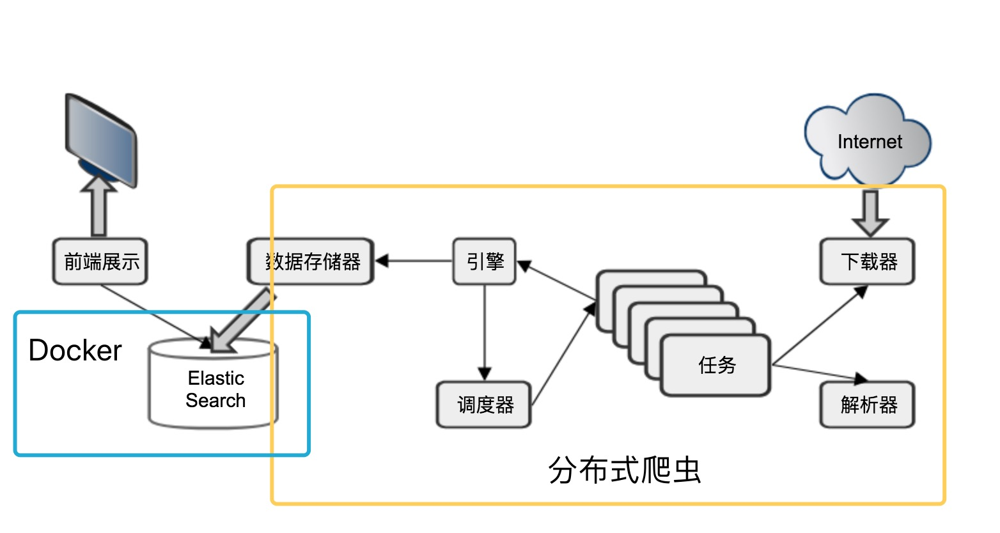
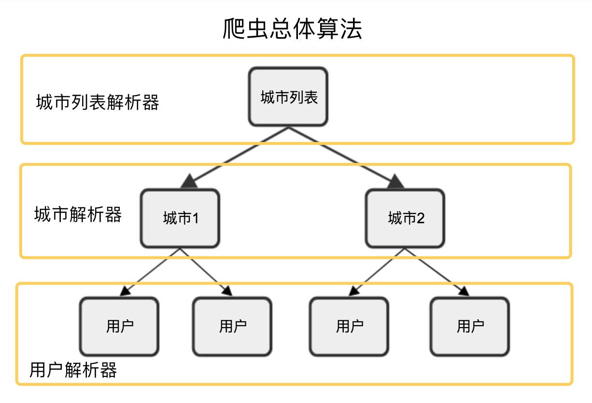
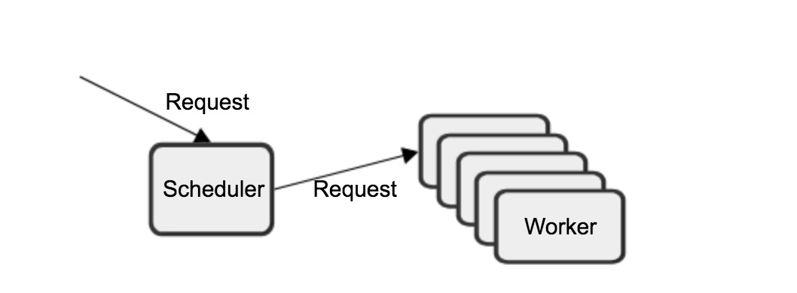
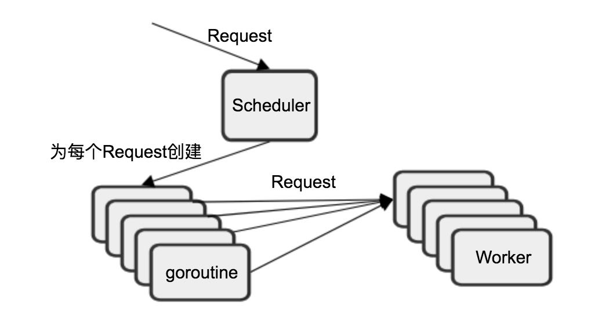
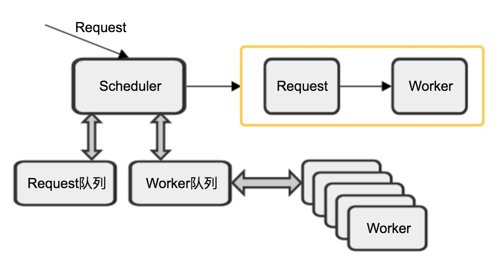
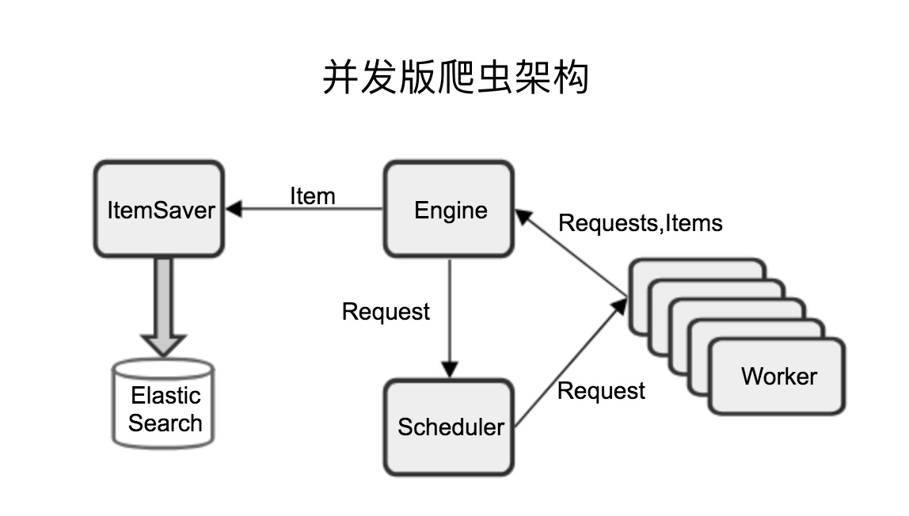
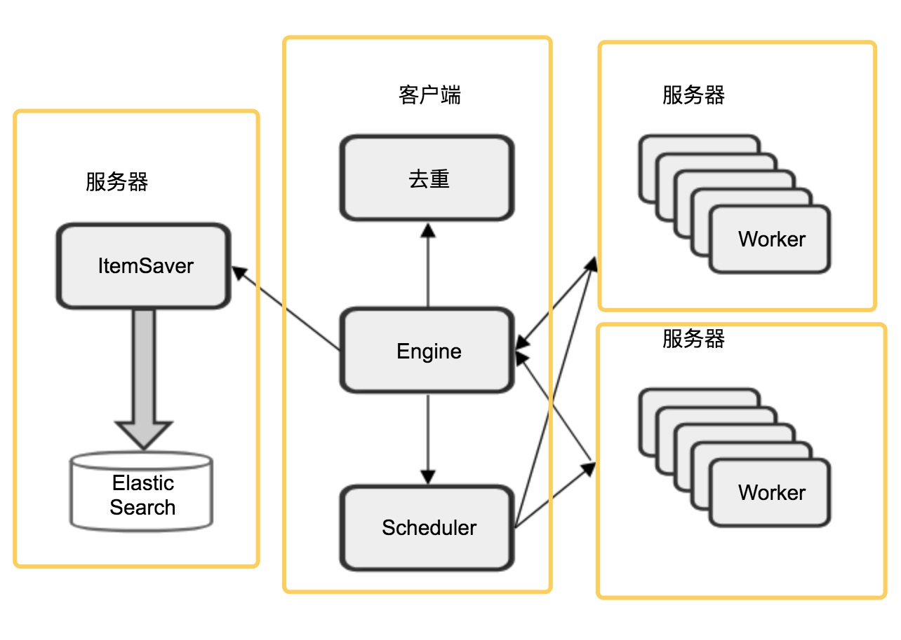
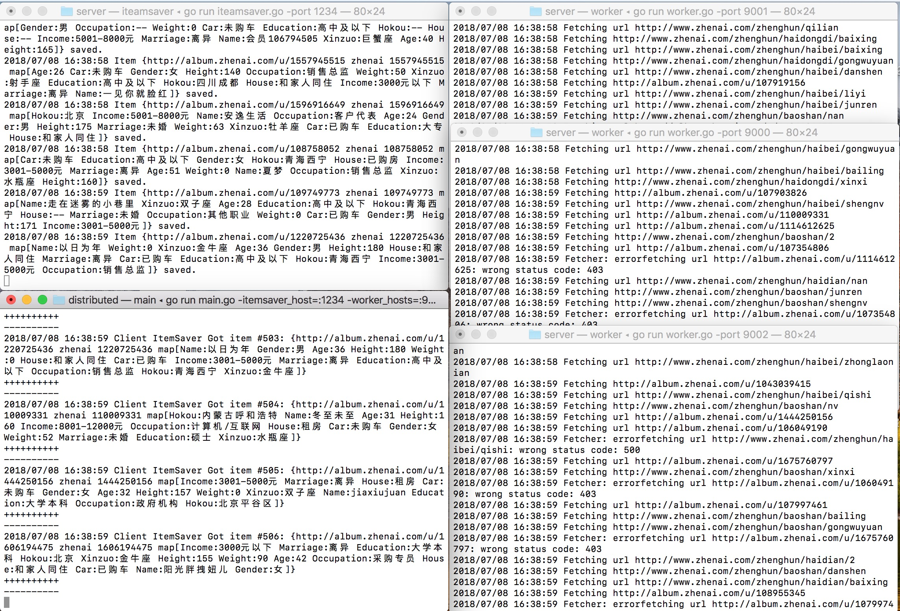

# spider
#### 爬虫的总体结构

<div align=center></div>

#### 爬虫的总体算法

<div align=center></div>

#### 单任务版爬虫结构
解析器Paeser
输入Utf-8编码文本
输出Request{URL,对应Parser}列表,Item列表

<div align=center></div>


#### 并发架构的演变
* Scheduler实现1:所有worker公用一个输入

<div align=center></div>
* Scheduler实现2:并发分发request

<div align=center></div>
* Scheduler实现3:request队列和worker队列

<div align=center></div>

* 并发版爬虫架构

<div align=center></div>

#### 并发版爬虫目前存在的问题:
- 限流问题
	- 单节点 能够承受的流量有限
	- 解决问题: 将worker放到不同的节点
- 去重问题
	- 单节点能承受的去重数据有限
	- 无法保存之前去重结果
	- 解决问题:基于key-value-store(如:redis) 进行分布式去重
- 数据存储问题
	- 存储部分的结构,技术栈和爬虫部分区别很大
	- 进一步优化需要特殊的ElasticSearch技术背景
	- 固有分布式

#### 分布式架构
并发节点拆分

<div align=center></div>

#### 使用说明
* 安装依赖:

```shell
go get github.com/urfave/cli
go get golang.org/x/text
go get golang.org/x/net
go get gopkg.in/olivere/elastic.v5
```
* docker

```
安装docker
docker run -d -p 9200:9200 elasticsearch
-d  在后台运行
-P  配置端口
9200:9200 端口号
elasticsearch  服务名
docker ps 查看正在运行的服务
docker kill  447182b34225(CONTAINER ID) 终止服务
docker logs  447182b34225(CONTAINER ID) 查看日志
```

* 启动存储服务

``` shell
cd /spiders/distributedCrawfer/distributed/persist/server 
go run iteamsaver.go --help (查看返回的格式要求)
go run iteamsaver.go -port 1234
```

* 启动多个worker

``` shell
cd /spiders/distributedCrawfer/distributed/worker/server 
go run worker.go --help (查看返回的格式要求)
go run worker - port 900
go run worker - port 9001
go run worker - port 9002
```

* 启动调度器

```
cd /spiders/distributedCrawfer/distributed
go run main.go --help  (查看返回的格式要求)
go run main.go -itemsaver_host=":1234" -worker_hosts=":9000,:9001,:9002"
```
#### 运行结果




